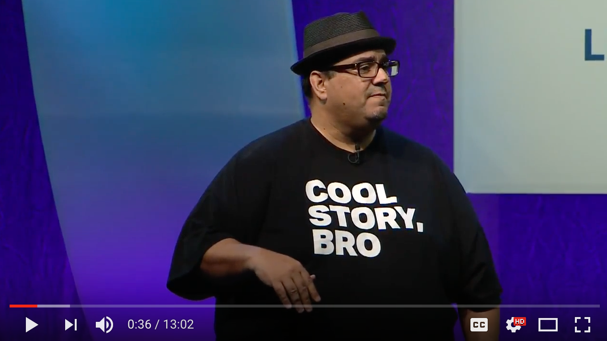

# Scoping eCommerce Projects

## Patrick Rauland

## @BFTrick

^ It was the early 2000s and the US Navy was looking to build a new type of ship.

^ You see the navy has traditionally built single purpose ships.

---

^ There are aircraft carriers that can carry 63 aircraft of various types

^ But they're slow, really expensive, and they take forever to build.

^ A new aircraft carrier costs in between 2-5 billion. And the US is looking at designing new aircraft carriers and the cost for development and design is going to be closer to 10-12 billion.

^ And aircraft carriers take around 5 years to build. So if you think you might need to use an aircraft carrier you better have started building it 5 years ago.

---

^ There are destroyers. They're good at short range battles but don't hold any aircraft. And they usually need to team up with bigger ships.

^ These are much cheaper but they still cost a lot to build and they take a lot less time to create

---

^ There are mine sweeper boats. They use advanced sonar and imaging with remote controlled explosives to detect and neutralize mines.

---

# Littoral combat ship

^ So that brings us back to this ship, the Littoral Combat Ship. US Navy realized that they have all of these different needs and each ship does one thing really well. Which is okay except you need to run all of these ships together in a fleet.

^ What if we combined all of these needs together. What if we could make one boat that could do all of these. It could save us a ton of money and we'd get the same benefit.

^ We could use cheaper construction materials and abandon the ship once it's taken a hit.

^ And this actually can make financial sense. You see it takes a lot of highly specialized building materials and space to be able to take a hit from a cannon.

^ You could instead create two slightly less well-built ships for the same price. And having two ships gives you more fire power and if your ship does take a hit you can abandon ship and go back to base in the other ship.

^ Now in _theory_ all of this should work really well.

^ Of course you can already guess that things won't turn out well.

---

# $200 Million

## Hold aircraft
## Cannons
## Clear mines

^ So the US Navy continues to work on this ship. They estimate it will take 200 million dollars to build.

^ and they say it will hold aircraft, will have cannons, and it will be able to clear mines.

^ Congress signs off on this and they start construction

---

# Who cares about details?

^ Now they knew they wanted a ship that could hold aircraft, shoot targets, and clear mines. But they didn't have a plan.

^ So as the ship is being constructed people in the navy are deciding how to do that.

^ they didn't know how many aircraft they wanted. Should they have one helicopter and a rear cannon? Or maybe we could get rid of the cannon and have a second helicopter?

^ Do we reduce our top speed from 40 knots to 30 knots so we can have more internal space for crew and mine clearing gear. Or do we want to keep our speed?

^ Do we add more advanced computers & automation so things will run more smoothly? Or do we want to use more crew?

^ Yes - the US Navy started building a ship without knowing what's going to go into the ship

---

# [fit]Costs Inflate

^ Several years into the project the finish the design. Everyone added all of the features they thought were necessary.

^ Now once they added up the costs of all of the bells & whistles they realized that these ships aren't going to cost $200 million. They're going to cost...

---

# [fit]$300-400 Million

^ And remember they were supposed to cost 200 million. So now that they're twice as expensive they have a choice.

^ Do they scrap the project - put it on hold to give them time to figure something else out - or do they continue?

^ They continue.

^ And actually they decide since the ship costs so much more that they should invest in that stronger construction so it can take more than one hit.

^ So now the ships cost 478 million dollars each.

^ And that's the new cost. Remember how they already started construction? Well now they have to go back and retrofit the ships that were under construction.

^ The USS Freedom cost $637 million

^ The USS Independence costs $708 million

---

# Performance

^ You might be thinking "okay they had some budget issues. So what? They got the ship they wanted right? Just slightly more expensive."

^ The answer is "kinda".

---

# Major Defects

* Clutch assembly failures
* Propulsion contaminated by sea water
* Hull cracks

^ my favorite on this list is hull cracks. The absolute minimum a boat should do is float. If you can't do that then I don't care how far the gun can shoot.

---

> “Next to no combat capability”
- Senator John McCain

^ Chairman of the armed services committee

---

> “These ships have little chance of survival in a battle space”
- Michele Mackin, GAO

^ Government Accountability Office

---

> “I wouldn’t certify the crews & ships to go”
- Jordy Harrison, US Navy

---

# Scoping

^ So why am I sharing all of this with you?

^ Because scoping a project is important.

---

# How the US Navy builds ships

1. Create wishlist
2. Fund "plan" aka wishlist
3. Start building ships
4. Figure out what goes in the ships
5. Retroactively fix stuff

^ and of course the end result is that your projects are twice as expensive as they should be. And they leak sea water.

---

# You need to have a plan _before_ you start building

^ Notice that before is highlighted. This is the opposite of what the navy did.

---

# Approaches to building websites

1. Waterfall
2. Phases
3. MVP

^ I'm going to talk about three different blue prints if you will. Three different ways you could build websites.

---

# 1. Waterfall

## Plan _everything_

---

^ everything is a phase

^ you can't move onto the next phase without first completing the previous phase

^ this approach is really good if you know if you're experienced with e-commerce and the client is experienced with e-commerce.

^ Both of you know what questions to ask and what expectations to set.

^ This is probably the most common project management strategy. Everyone knows it and just about every one is comfortable with it.

^ This method doesn't work great if you have to spend a lot of time educating your client. If they've never build a website or never built and e-commerce site you could spend a significant amount of time educating them. And then I'd recommend a different strategy.

^ Really helpful for re-platforming from another system.

^ Because the client knows how they're shipping products, they know and already are accepting payment, and there's few unknown unknowns.

---

# 2. Phases

## Do what you know

---

^ This is the area where I've had the most success. It works well when you have expertise and your client doesn't. Let's say it's their first e-commerce site. You'll have to do a lot of education with them.

^ This way you can create a pretty tight estimate for phase 1. Just the website. Let's say for 5 grand. And then you say based on what we come up with in phase 2 is could cost between 2 & 10 grand based on what options you choose.

^ This is pretty comfortable for clients. They know this format. It moves the project forward while you discuss the ins & outs of e-commerce.

^ When I worked at a smaller agency we brought in a few of these. The first phase would take maybe 1-3 months and cost 10 grand. And then second phase took something like 1 year. Because they just didn't know what they were doing with e-commerce. they had to figure out how to accept money online and how to fulfill orders.

^ So this is really good for your planning purposes, it's good for your cashflow, and it's good for the client. I'm a huge fan of this process.

^ Good when someone has a website but not an e-commerce site.

^ Educate them on accepting money, carts, online chat, fulfillment, live shipping rates, etc.

---

# 3. MVP

## Do what's easiest

---

^ everyone wants the lambrogini of e-commerce sites. They want you to copy Amazon.com, add features, and charge less than a grand.

^ And I get why people want this but they don't realize how complicated some of these things are.

^ If you are new to e-commerce and your client is new the MVP model might be best. It's where you build the tinciest easiest website possible and add features as you go.

^ What's great about this model is it reduces the unknown unknowns. That's always the hardest part of any project.

^ You build the simplest website ever. Don't worry about the buy with Amazon button. Just add Stripe to the website. You can figure out the amazon button later.

^ Same thing with subscriptions. Those are complicated. Start with simple products bought one at a time. And then add subscriptions down the line.

^ This is the closest to hourly that I would recommend for e-commerce. You sort of have a very simple completed project and then add on features as you go on an hourly rate.

^ I really do recommend this for your first e-commerce site.

^ So we've talked about the different approaches to building websites. Now let's talk about e-commerce specifically.

---

# Discovery for eCommerce

---

# The Key to Discovery is _Active Listening_

##  ... and Checking Your Assumptions

---

> "I want a clean, sleek, minimal design"

^ But what does that mean? Because what I consider clean & minimal might not be what my client thinks is minimal.

^ So make sure you ask them for examples.

---

# Your client will likely ask for a website

^ it's your job to ask them the right questions. They don't know what they don't know.

^ if you want a positive relationship with them you'll have to remove obstacles for them. Whether they're obstacles they've thought of or obstacles they haven't.

---

# Talk about the journey for each product

^ how does someone find the product? How do they find your site? Maybe coupons that connect their online & physical store are important.

^ how does the product get to them?

^ what happens after they order the product? Fulfillment, Ratings, reviews?

^ a side benefit is that both you and the client are thinking about the client.

---

# What Do They Need?

* What types of products do they plan on selling?
* How many resources will they need?
* How do they plan on shipping products?
* How do they plan on accepting payment online?
* Will they need multiple languages or currencies?
* How are they planning on handling taxes?
* What other integrations will they need?

^ Now I put all of these together onto one slide in case anyone wants to take a picture

^ But I'm going to go into each one of these individually so don't worry about writing everything down.

---

## What types of products do they plan on selling?

^ this is a really big and important question. This question usually tells you what type of e-commerce platform you'll use.

^ are they only planning on selling one ebook? Maybe go with Gumroad.

^ Are they planning on selling software? I'd probably go with Easy digital downloads.

^ Are they planning on selling physical products? Or a combination of the above? I'd probably go with WooCommerce.

^ One thing to watch out for here. Don't just ask them what they're planning on selling this year.

---

## Ask them about where they want to go

^ If they're starting with 1 ebook but they want to eventually start selling coffee mugs and other physical goods I'd go WooCommerce. So they can grow without having to switch platforms.

---

## How many resources will they need?

### https://youtu.be/ucAne6bcSkI

^ Basically you need to know how big their brand is. How many sales are they expecting in the first month or the first year.

^ I'd say 95% of e-commerce stores are going to be tiny to start and they won't need any special considerations. But sometimes you will work with a brilliant marketer and their product will take off.

^ Chris Lema gave an amazing talk about scaling WooCommerce up to 2,000 add to carts per minute.

^ That's insane. And also insanely cool.

^ So it's good to know your upper limit. If you have someone who will generate that amount of traffic you'll need to look into custom hosting, custom programming and a lot more.

^ But luckily 95% of stores aren't going to have that problem. Most stores are going to have something like 1 sale a week when they launch.

---

## How do they plan on shipping products?

^ Now I've had mixed results with shipping. When I work with freelancers or a brand new store owner they're very flexible and they'll ship with whatever is most convenient. They'll usually pick FedEx, USPS, or UPS and just go with it.

^ With established companies they might have a deal with a shipping company. And that's fine. What's worse is when they're in negotiations with the shipping companies for lower rates so they can't settle on a shipping company for weeks or months.

^ I've had that happen.

^ So nail down how your client is going to ship.

^ And if you can't get them to nail anything down right now. Keep it as a variable in your proposal. Say we'll figure out shipping later but it will cost in between this range.

---

## How do they plan on accepting payment online?

^ Payments can be really complex or really simple. Again with small or brand new companies if you recommend Stripe or PayPal they'll usually take your recommendation and be fine with it.

^ And both of those are really easy to setup. It won't take more than a 15 minutes once you know what you're doing.

^ But sometimes clients have weird payment gateways. And sometimes those gateways don't have an integration with WooCommerce and they'll take 40 hours to program. Or they take forever to setup becuase you can't get their API keys.

^ This is where you can add language to your contract to protect you and your client.

---

"Will add functionality to process credit cards on site with a modern gateway (ex. Stripe or Braintree). If using an older, less known, or more complicated gateway additional fees may apply."

---

## Will they need multiple languages or currencies?

^ This can be massively complex. Especially currencies. There are setups for using WPML with WooCommerce. And then each instance of WooCommerce will have it's own currency.

^ But if you do this you'll likely want a 3rd party platform to manage all of your orders and another 3rd party platform to manage inventory between your sites.

^ Multiple languages & currencies can double or triple the cost for a project. So for most small businesses it's not worth it. When a client asks you about multiple languages you can entertain the idea. But make sure they understand the cost benefit ratio.

---

## How are they planning on handling taxes?

* Manual
* Automated: TaxJar

^ Taxes are not handled by eCommerce platforms. 9 times out of 10 you have to enter and confirm the tax rates your self. That means you have to get them from the client. Which means the client has to get them.

^ I often advise using a 3rd party tax service like TaxJar.

---

## What other tools do you work with?

^ Make sure you ask them about any other integrations. Any time they need to fetch, update, or combine data it could be a massive amount of work. And you want to know that before you start any project.

---

# 2. Definition

^ telling your client exactly what you're going to do

^ now if you're doing MVP. These take a lot of time to create. So they probably aren't worth it.

---

# What You're Going to Do

* Sitemaps
* Wireframes
* Prototyping
* Tech specs
* Client expectations
* Overhead
* Communication tools & Frequency

^ I'll cover each of these in detail in a minute. But I've put them all here for any picture takers

^ Now each agency or freelancer will probably do some combination of these. You certainly don't have to do them all.

---

## Sitemaps

* About Us (bio of founder)
* Shop page (list 4 products)
    * Individual product pages (buy button)
* Cart & Checkout (accept payment)
* Contact (includes a form)

^ sitemaps are there to make sure that all of your pages are accounted for.

^ So if there's content on the site it should be represented in the site map

^ again this is something that's really nice to have the client sign off on.

---

## Wireframes

^ wireframes are there to show what content will appear on the page.

^ they're minimalistic and that's the point. Instead of the client worrying about button color they focus on that content of the page. So if there was a miscommuncation about what should be in the sidebar this is where you catch it.

^ If you show a client a design I promise you they'll bug you endlessly about the size of the buttons or the color of the search box. And they could miss something really important.

^ I like to have clients sign off on wire frames. Makes sure they say "yes everything is included"

---

## Prototypes

^ prototypes are there to show a client what something could look like. When they ask about instant search. What does that mean exactly? Examples are really good place to start.

^ But sometimes even an example might not be enough. In that case it's helpful to prototype something. Here's what our instant filtering looks like for products.

^ once a client has seen something if they like it they can sign off. And if they don't like it they can request something different but that likely means paying more for it.

---

## Tech Specs

^ I like to get on the same page with hosting and other technology. Make sure they see the cost of hosting and they sign off on it.

---

## Client Expectations

^ Now I like to include a section in my proposal with client expectations.

^ There are clients that expect you to update plugins and themes for free.

^ There are clients that expect you to update the tax information every year for free.

^ And There are clients out there who assume you'll ship their products for them.

^ If you can communicate what you'll do and what you expect them to do that's very helpful. Keep in mind most clients aren't bad. They just don't know what questions to ask. They might assume taxes update automatically. And I think that's a fair assumption. So go over all of this with them. Make sure they are responsible for x, y, & z.

^ I usually like to set the expectation that this website is version 1. There will likely be some things that aren't quite working the way they imagined. And we can catch up a month after launch and start working on a proposal for updates.

---

## Overhead

^ Now this isn't I bill my clients for but it is important for you to build into your costs.

^ In a recent project I spent about 1/3 of my time communicating with the company. Now many project managers recommend you have one point of contact. And that's an okay idea. But I like being embedded in a company. It means I can give answers directly to the person who asked the question. And if there are follow ups I can respond to those.

^ I get better data and I get more buy in from a company this way. But it does cost something. It costs me a lot of my time.

^ I probably spent 8 hour writing up the contract, 8-10 hours doing the work, another 12 hours synthesizing all of the work I did and writing a report and then 10 hours of communication with their team.

^ So for me I did 20 hours of work. With 20 hours of other work related things on top of that. So take that into account with your estimates.

---

## Communication Tools & Frequency

^ and that is cost saving. If you have fewer meetings you can save a lot of money.

^ But of course you might notice a problem later than expected and that could cost you more money.

^ The trick is to find the sweet spot for your company and your client.

---

# 3. Proposal

^ the last step is to present the proposal to your client.

^ I always recommend doing this in person. They can go through it line by line if they want and ask you any questions. There's a lower barrier to entry to ask questions in person that in an email. So I really like in person meetings for this.

---

# About Patrick Rauland

^ So my name is Patrick Rauland. I'm a lynda.com author, I create e-commerce sites, I consult with WordPress VIP companies on e-commerce proposals, and I'm currently consulting with Automattic to put on WooConf - the annual WooCommerce Conference.

* http://speakinginbytes.com
* http://www.lynda.com/trial/patrickrauland
