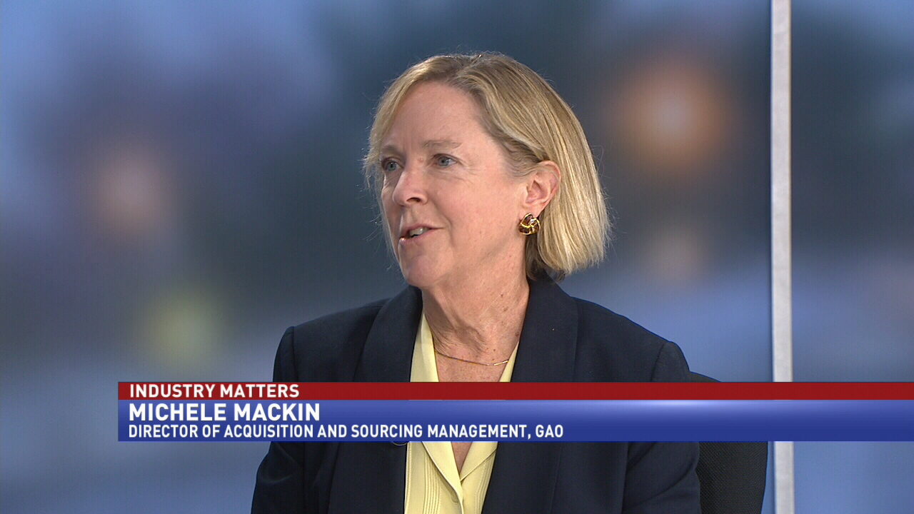

# Scoping eCommerce Projects

## Patrick Rauland

## @BFTrick

^ It was the early 2000s and the US Navy was looking to build a new type of ship.

^ You see the navy has traditionally built single purpose ships.

---

^ There are aircraft carriers that can carry 63 aircraft of various types

^ But they're slow, really expensive (2-5 billion), and they take forever to build.

---

^ There are destroyers. They're good at medium range battles but don't hold any aircraft so they can't do any land based missions. And because of that they usually need to team up with bigger ships.

^ These are much cheaper but they still cost a lot to build

---

^ There are mine sweeper boats. They use advanced sonar and imaging with remote controlled explosives to detect and neutralize mines.

---

# Littoral combat ship

^ So that brings us back to this ship, the Littoral Combat Ship. US Navy realized that they have all of these different needs and each ship does one thing really well. Which is okay except you need to run all of these ships together in a fleet.

^ What if we combined all of these needs together. What if we could make one boat that could do all of these. It could save us a ton of money and we'd get the same benefit.

^ Now in _theory_ all of this should work really well.

^ Of course you can probably already guess that things won't turn out well.

---

# $200 Million

## Hold aircraft
## Cannons
## Clear mines

^ So the US Navy continues to work on this ship. They estimate it will take 200 million dollars to build.

^ and they say it will hold aircraft, will have cannons, and it will be able to clear mines.

^ Congress signs off on this and they start construction

---

# Who cares about details?

^ Now they knew they wanted a ship that could hold aircraft, shoot cannons, and clear mines. But they didn't have a plan.

^ So as the ship is being constructed people in the navy are deciding how to do that.

^ they didn't know how many aircraft they wanted. Should they have one helicopter and a rear cannon? Or maybe we could get rid of the cannon and have a second helicopter?

^ Do we reduce our top speed from 40 knots to 30 knots so we can have more internal space for crew and mine clearing gear. Or do we want to keep our speed?

^ Do we add more advanced computers & automation so things will run more smoothly? Or do we want to use more crew?

^ Yes - the US Navy started building a ship without knowing what's going to go into the ship

---

# [fit]Costs Inflate

^ Several years into the project the finish the design. Everyone added all of the features they thought were necessary.

^ Now once they added up the costs of all of the bells & whistles they realized that these ships aren't going to cost $200 million. They're going to cost...

---

# [fit] $300-400 Million

^ And remember they were supposed to cost 200 million. So now that they're twice as expensive.

^ And since they cost so much more they decide to use better building materials so the ship can survive longer.

---

# [fit] $478 Million

^ So now the ships cost 478 million dollars each.

^ And that's the new cost. Remember how they already started construction? Well now they have to go back and retrofit the ships that were under construction.

---

## USS Freedom $478 Million
## USS Independence $708 Million

^ The USS Freedom cost $637 million

^ The USS Independence costs $708 million

---

# Performance

^ You might be thinking "okay they had some budget issues. So what? They got the ship they wanted right? Just slightly more expensive."

^ The answer is "kinda".

---

# Major Defects

* Clutch assembly failures
* Propulsion contaminated by sea water
* Hull cracks

^ my favorite on this list is hull cracks. The absolute minimum a boat should do is float. If you can't do that then I don't care how far the gun can shoot.

---

> “Next to no combat capability”
- Senator John McCain

^ Chairman of the armed services committee

---

> “These ships have little chance of survival in a battle space”
- Michele Mackin, GAO

^ Government Accountability Office

---

> “I wouldn’t certify the crews & ships to go”
- Jordy Harrison, US Navy

---

# Scoping

^ So why am I sharing all of this with you?

^ Because scoping a project is important.

---

# How the US Navy builds ships

1. Create wishlist
2. Fund "plan" aka wishlist
3. Start building ships
4. Figure out what goes in the ships
5. Retroactively fix stuff

^ and of course the end result is that your projects are twice as expensive as they should be. And they leak sea water.

---

# You need to have a plan _before_ you start building

^ Notice that before is highlighted. This is the opposite of what the navy did.

---

# Approaches to building websites

1. Waterfall
2. Phases
3. MVP

^ I'm going to talk about three different blue prints if you will. Three different ways you could build websites.

---

# 1. Waterfall

## Plan _everything_

---

^ everything is a phase

^ you can't move onto the next phase without first completing the previous phase

^ this approach is really good if you know if you're experienced with e-commerce and the client is experienced with e-commerce.

^ Both of you know what questions to ask and what expectations to set.

^ This is probably the most common project management strategy. Everyone knows it and just about every one is comfortable with it.

^ This method doesn't work great if you have to spend a lot of time educating your client. If they've never build a website or never built and e-commerce site you could spend a significant amount of time educating them. And then I'd recommend a different strategy.

^ Really helpful for re-platforming from another system.

^ Because the client knows how they're shipping products, they know and already are accepting payment, and there's few unknown unknowns.

---

# 2. Phases

## Do what you know

---

^ This is the area where I've had the most success. It works well when you have expertise and your client doesn't. Let's say it's their first e-commerce site. You'll have to do a lot of education with them.

^ This way you can create a pretty tight estimate for phase 1. Just the website. Let's say for 5 grand. And then you say based on what we come up with in phase 2 is could cost between 2 & 10 grand based on what options you choose.

^ This is pretty comfortable for clients. They know this format. It moves the project forward while you discuss the ins & outs of e-commerce.

^ When I worked at a smaller agency we brought in a few of these. The first phase would take maybe 1-3 months and cost 10 grand. And then second phase took something like 1 year. Because they just didn't know what they were doing with e-commerce. they had to figure out how to accept money online and how to fulfill orders.

^ So this is really good for your planning purposes, it's good for your cashflow, and it's good for the client. I'm a huge fan of this process.

^ Good when someone has a website but not an e-commerce site.

^ Educate them on accepting money, carts, online chat, fulfillment, live shipping rates, etc.

---

# 3. MVP

## Do what's easiest

---

^ everyone wants the lambrogini of e-commerce sites. They want you to copy Amazon.com, add features, and charge less than a grand.

^ And I get why people want this but they don't realize how complicated some of these things are.

^ If you are new to e-commerce and your client is new the MVP model might be best. It's where you build the tinciest easiest website possible and add features as you go.

^ What's great about this model is it reduces the unknown unknowns. That's always the hardest part of any project.

^ You build the simplest website ever. Don't worry about the buy with Amazon button. Just add Stripe to the website. You can figure out the amazon button later.

^ Same thing with subscriptions. Those are complicated. Start with simple products bought one at a time. And then add subscriptions down the line.

^ This is the closest to hourly that I would recommend for e-commerce. You sort of have a very simple completed project and then add on features as you go on an hourly rate.

^ I really do recommend this for your first e-commerce site.

^ So we've talked about the different approaches to building websites. Now let's talk about e-commerce specifically.

---

# Discovery for eCommerce

---

# The Key to Discovery is _Active Listening_

##  ... and Checking Your Assumptions

---

> "I want a clean, sleek, minimal design"

^ But what does that mean? Because what I consider clean & minimal might not be what my client thinks is minimal.

^ So make sure you ask them for examples.

---

# Your client will likely ask for a website

^ it's your job to ask them the right questions. They don't know what they don't know.

^ if you want a positive relationship with them you'll have to remove obstacles for them. Whether they're obstacles they've thought of or obstacles they haven't.

---

# Talk about the journey for each product

^ how does someone find the product? How do they find your site? Maybe coupons that connect their online & physical store are important.

^ how does the product get to them?

^ what happens after they order the product? Fulfillment, Ratings, reviews?

^ a side benefit is that both you and the client are thinking about the client.

---

## Ask them about where they want to go

^ If they're starting with 1 ebook but they want to eventually start selling coffee mugs and other physical goods I'd go WooCommerce. So they can grow without having to switch platforms.

---

# 2. Definition

^ So after discovery where you figure out everything you need. The next step is to repeat it all back to the client. You want to make it as clear as possible what you're going to do.

^ Depending on the type of project, the budget, and your project management style you may decided to do some of these, none of these, or all of these.

---

# Define what you're going to do

* Sitemaps
* Wireframes
* Prototyping
* Tech specs
* Client expectations
* Communication tools & Frequency

^ I tend to do sitemaps with every project. You're just defining what pages are going to be where and what type of content is on each page.

^ Wireframes are helpful when someone wants a custom theme developed. It's a tool to make sure that everything is on each page. Regardless of the design. People focus less on the pixels and more on the content.

^ Prototypes are great when the client wants some custom search functionality like instant search. You can show them something quickly to make sure you're on the same page.

^ Confirm the technical specifications you're going to use. Let them know this is what you think they'll need. And what could be added down the line.

^ Setting client expectations is super important. People who are new to e-commerce have no idea what they have to do. I've run into clients who assume you'll ship their packages for them. Or you'll manage their orders. Or you'll update their tax rates for them.

^ You can address this by putting in your contract. Once a year we'll update tax rates. Or we'll install Tax Jar or some other service to keep your tax rates up to date.

^ And then lastly communication. I've found it really helpful to talk about how often you will communicate with them during and after the process.

^ Now each agency or freelancer will probably do some combination of these. You certainly don't have to do them all. The bigger the budget the more of these you'll want to do.

---

# 3. Proposal

^ the last step is to present the proposal to your client.

^ I always recommend doing this in person. They can go through it line by line if they want and ask you any questions. There's a lower barrier to entry to ask questions in person that in an email. So I really like in person meetings for this.

---

# Remember: Have a _plan_!

^ The US Navy has a really inefficient process. They start multi-million dollar projects without looking at any of the details. And they cost 2-3 times as much as originally promised. And they have severe issues.

^ If you want to deliver projects on time, under project, and fully functional then have a plan.

---

# Questions?

* http://speakinginbytes.com
* http://www.lynda.com/trial/patrickrauland
* http://wooconf.com

^ So my name is Patrick Rauland. I'm a Lynda.com author, I create e-commerce sites, I consult with WordPress VIP companies on e-commerce proposals, and I'm currently consulting with Automattic to put on WooConf - the annual WooCommerce Conference.

^ The lynda link is a free 10 day trial to Lynda.com. I have 7 WordPress courses. 2 of which are about WooCommerce. So there's lots of good e-commerce stuff up there.
